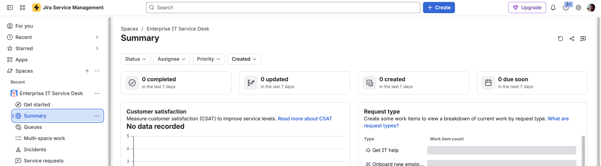
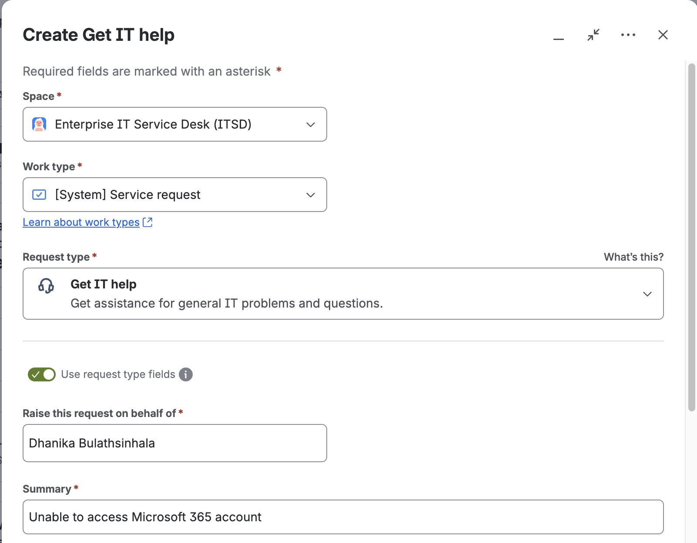
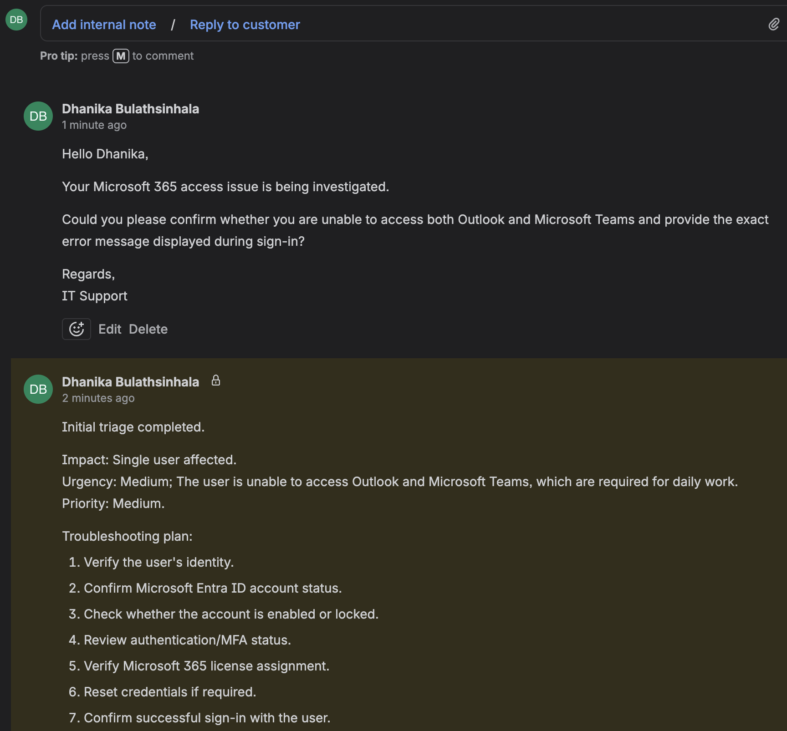
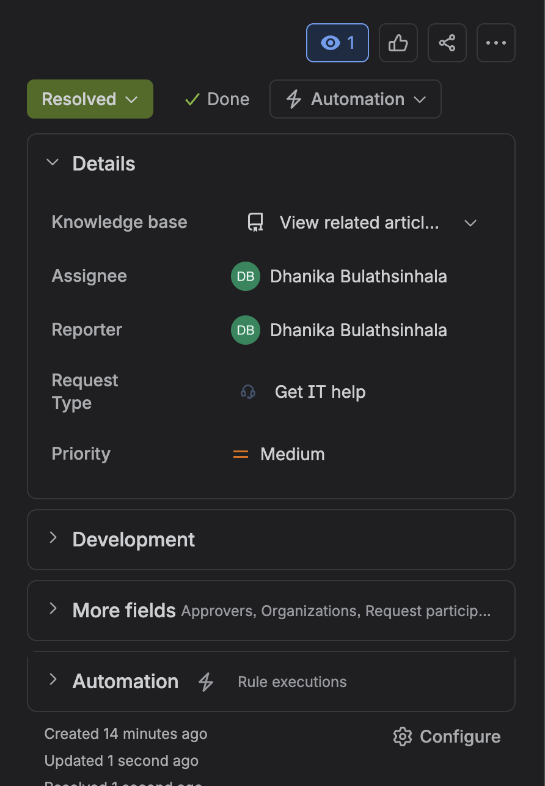
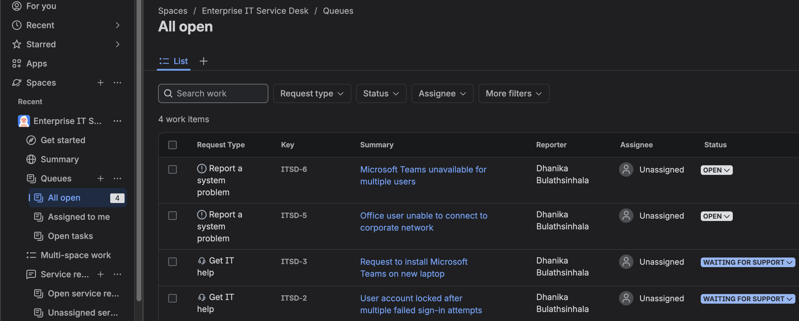
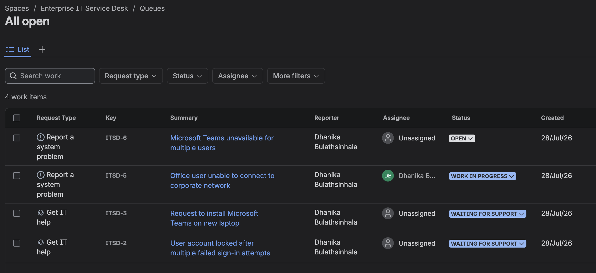
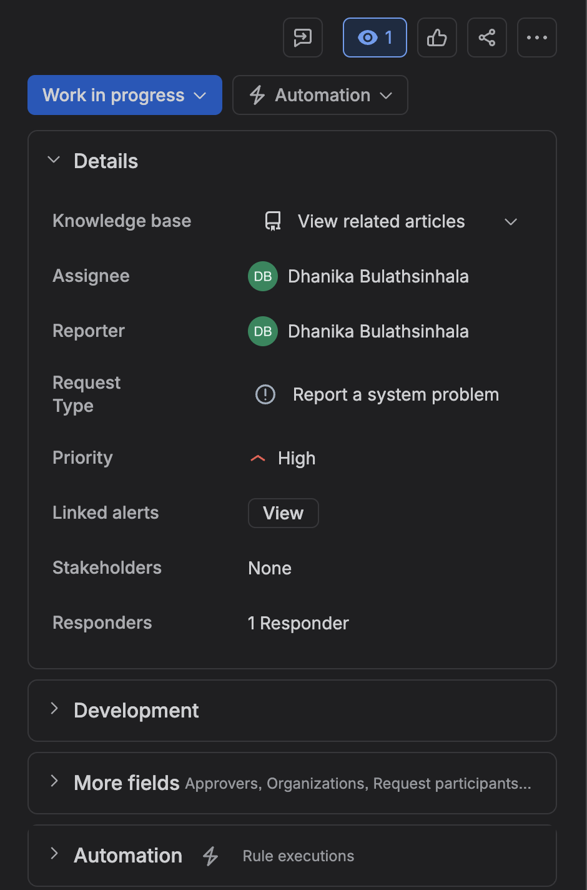
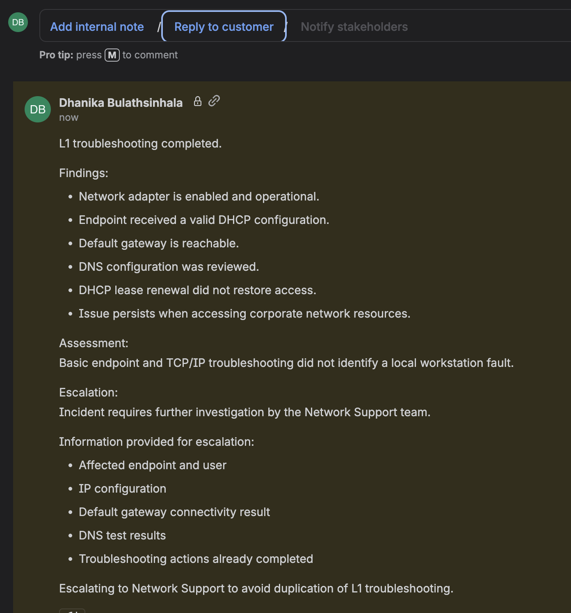

# Project 01 – Jira Service Management Help Desk

## Overview

This project demonstrates the setup and operation of an enterprise-style IT help desk using Jira Service Management (JSM).

The lab focuses on practical L1 IT Support responsibilities, including service-request handling, incident management, ticket prioritisation, queue management, customer communication, troubleshooting documentation, ticket resolution, and escalation to higher-level support teams.

---

## Scenario

An internal IT service desk provides technical support to employees across the organisation.

As an L1 IT Support technician, the objective was to receive user requests, classify and prioritise tickets, document troubleshooting activities, communicate with users, resolve common support issues, and escalate incidents that could not be resolved at the first support level.

---

## Technologies

| Component | Technology |
|---|---|
| ITSM Platform | Jira Service Management |
| Service Desk | Enterprise IT Service Desk |
| Project Key | ITSD |
| Identity Scenario | Microsoft Entra ID |
| Productivity Platform | Microsoft 365 |
| Endpoint Scenario | Windows 11 |
| Support Model | L1 IT Support |

---

## Project Structure

```text
01-Jira-Service-Management-Help-Desk/
├── README.md
└── Screenshots/
    ├── 01_New_IT_Support_Ticket.png
    ├── 02_Ticket_Triage_and_Customer_Communication.png
    ├── 03_Technical_Investigation_and_Resolution.png
    ├── 04_Resolved_IT_Support_Ticket.png
    ├── 05_Service_Desk_Tickets.png
    ├── 06_IT_Service_Desk_Open_Queue.png
    ├── 07_High_Priority_Incident_Triage.png
    └── 08_Network_Incident_Escalation.png
```

> Screenshot filenames can be adjusted to match the exact names used in the repository.

---

# 1. IT Service Desk Environment

An `Enterprise IT Service Desk` environment was created using Jira Service Management.

The service desk provides functionality for:

- Service requests
- Incidents
- Ticket queues
- Ticket assignment
- Customer communication
- Internal support notes
- Prioritisation
- Reporting
- Escalation workflows

This environment was used to simulate day-to-day L1 IT Support operations.

---

# 2. Microsoft 365 Support Request

The first scenario involved a user who could not access Microsoft 365.

### Issue

```text
Unable to access Microsoft 365 account
```

The user reported authentication problems preventing access to:

- Outlook
- Microsoft Teams

The issue affected a single user and was assigned a Medium priority.



---

# 3. Initial Ticket Triage

The request was reviewed and an initial triage assessment was documented.

The investigation plan included:

1. Verify the user's identity.
2. Confirm Microsoft Entra ID account status.
3. Check whether the account was enabled.
4. Review authentication and MFA status.
5. Verify Microsoft 365 licensing.
6. Perform credential recovery if required.
7. Confirm successful authentication with the user.

Impact and urgency were considered before maintaining the ticket at Medium priority.

---

## Internal Notes

Troubleshooting activities were documented using Jira internal notes.

Internal notes separate technician-facing investigation information from customer-facing communication.

---

## Customer Communication

The user was informed that the issue was under investigation and was asked to provide additional authentication information.



---

# 4. Technical Investigation

The Microsoft 365 authentication scenario included investigation of:

- User identity
- Microsoft Entra ID account state
- Authentication status
- MFA configuration
- Microsoft 365 licensing
- User credentials

The simulated investigation determined that credential recovery was required.

The resolution procedure included credential recovery followed by renewed authentication and MFA verification.



---

# 5. Waiting for Customer

After completing the technical action, the ticket was moved to:

```text
Waiting for customer
```

This represented a common service-desk workflow where the technician has performed remediation but requires confirmation from the user before closing the ticket.

The user was asked to verify access to Outlook and Microsoft Teams.

---

# 6. Ticket Resolution

After successful access was recorded, final resolution documentation was added.

The resolution summary documented:

- Identity verification
- Account-status review
- Microsoft 365 licensing review
- MFA verification
- Credential recovery
- Restoration of Outlook access
- Restoration of Microsoft Teams access

The ticket was then resolved.



---

# 7. Service Desk Workload

Additional support scenarios were created to populate the service desk with a realistic mixture of requests and incidents.

Examples included:

| Scenario | Classification | Priority |
|---|---|---|
| Account locked after failed sign-in attempts | Service Request | Medium |
| Microsoft Teams installation request | Service Request | Low |
| User unable to connect to corporate network | Incident | High |
| Microsoft Teams unavailable for multiple users | Incident | High |

This demonstrates the distinction between routine fulfilment requests and unexpected service interruptions.



---

# 8. Queue Management

The Jira Service Management queue was used to review active support workload.

The queue provided visibility into:

- Open tickets
- Assignees
- Reporters
- Priority
- Ticket status
- Resolution state

This allows support technicians to identify unassigned requests and prioritise incidents requiring attention.



---

# 9. High-Priority Incident Triage

A network connectivity incident was selected for L1 troubleshooting.

### Incident

```text
Office user unable to connect to corporate network
```

### Priority

```text
High
```

The troubleshooting plan included:

```text
Verify network connection
        ↓
Check IP configuration
        ↓
Verify DHCP assignment
        ↓
Test default gateway
        ↓
Test DNS resolution
        ↓
Check network adapter
        ↓
Renew DHCP lease
        ↓
Determine whether escalation is required
```

The incident was assigned and moved into active investigation.



---

# 10. L1 Troubleshooting and Escalation

Initial troubleshooting established that:

- The network adapter was operational.
- The endpoint had received a valid DHCP configuration.
- The default gateway was reachable.
- DNS configuration had been reviewed.
- DHCP lease renewal did not restore access.
- Access to corporate resources remained unavailable.

The evidence did not indicate a straightforward local workstation fault.

Rather than continuing unnecessary L1 troubleshooting, the incident was documented for escalation to Network Support.

---

## Escalation Documentation

Information prepared for escalation included:

- Affected user
- Affected endpoint
- IP configuration
- Gateway connectivity results
- DNS testing results
- Troubleshooting already performed

Documenting previous troubleshooting helps the next support tier continue the investigation without unnecessarily repeating L1 actions.



---

# Service Desk Workflow Demonstrated

```text
User Request / Incident
          │
          ▼
     Ticket Creation
          │
          ▼
       L1 Triage
          │
          ▼
Impact + Urgency Assessment
          │
          ▼
    Priority Assignment
          │
          ▼
Technical Troubleshooting
          │
     ┌────┴─────┐
     │          │
     ▼          ▼
 Resolved    Not Resolved
     │          │
     ▼          ▼
Customer     Escalation
Confirmation   to L2
     │
     ▼
Ticket Closure
```

---

# Service Request vs Incident

This project also demonstrates basic ITSM classification.

### Service Request

A user asks IT to provide something or perform a standard service.

Examples:

- Software installation
- Access request
- Password/account assistance

### Incident

An unexpected interruption or degradation of an IT service.

Examples:

- Network connectivity failure
- Microsoft Teams outage
- Business application unavailable

Correct classification improves queue management, prioritisation, reporting, and escalation.

---

# Skills Demonstrated

- Jira Service Management
- IT Service Management
- Help Desk operations
- L1 IT Support
- Ticket lifecycle management
- Service request management
- Incident management
- Ticket assignment
- Queue management
- Impact assessment
- Urgency assessment
- Priority management
- Customer communication
- Internal technical documentation
- Troubleshooting documentation
- Microsoft 365 troubleshooting
- Microsoft Entra ID troubleshooting
- MFA troubleshooting
- Network troubleshooting
- DHCP troubleshooting
- DNS troubleshooting
- Incident escalation
- L1/L2 escalation procedures

---

# Lessons Learned

- Support tickets should contain enough information for another technician to understand the issue without repeating the initial investigation.
- Internal technical notes and customer-facing communication serve different purposes.
- Priority should reflect business impact and urgency rather than simply how technical an issue appears.
- Service requests and incidents represent different types of support work and should be classified accordingly.
- Moving a ticket to `Waiting for customer` clearly identifies when IT has completed an action but requires user verification.
- L1 troubleshooting should follow a structured process.
- Escalation is appropriate when initial troubleshooting indicates that an issue falls outside the L1 support scope.
- Escalation notes should include troubleshooting already completed and relevant diagnostic findings.
- A service desk queue provides operational visibility into workload, priority, ownership, and ticket status.

---

# Portfolio Outcome

This project established a functioning Jira Service Management help desk and demonstrated two different support outcomes:

**Successful L1 resolution**

```text
Microsoft 365 authentication issue
→ Triage
→ Investigation
→ Remediation
→ User verification
→ Resolution
```

**L1 investigation requiring escalation**

```text
Network connectivity incident
→ High-priority triage
→ Network troubleshooting
→ Findings documented
→ Escalation to Network Support
```

These workflows demonstrate practical service-desk responsibilities rather than only Jira configuration.

---

**Status:** Completed