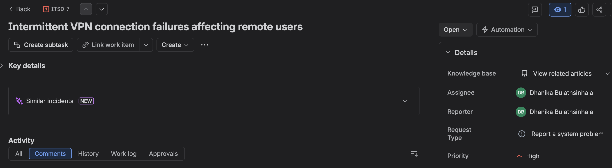
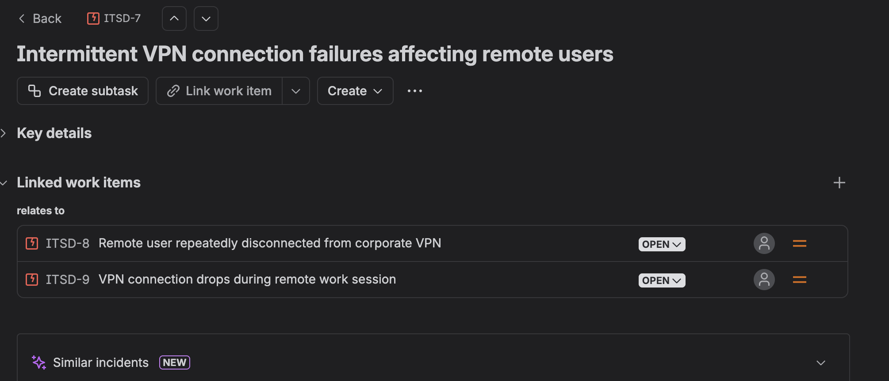
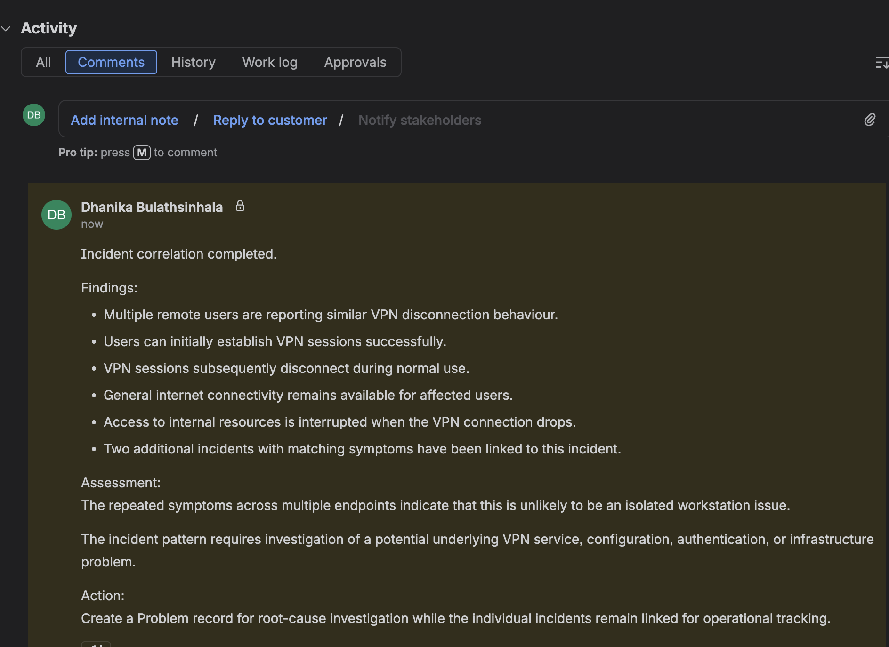
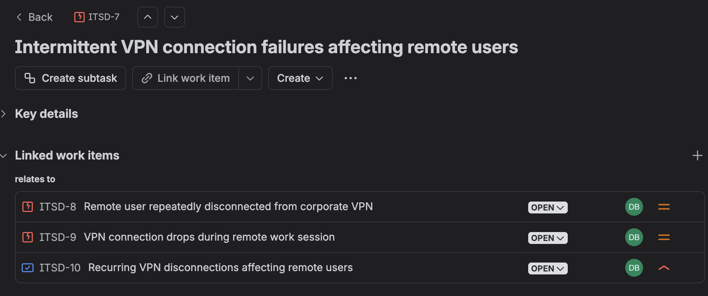
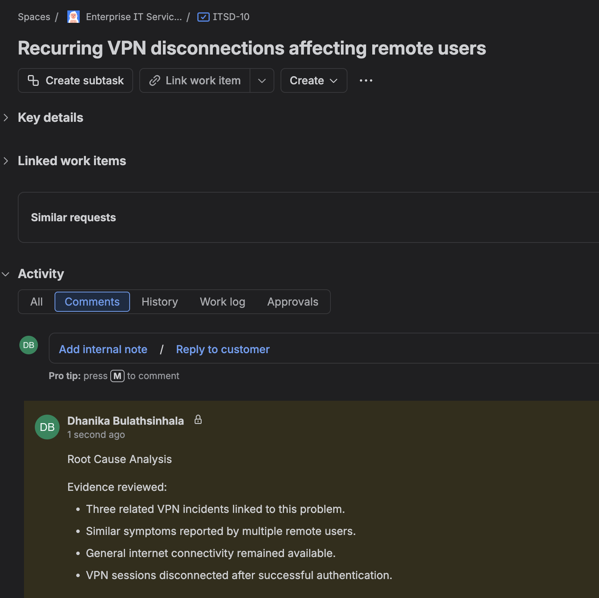
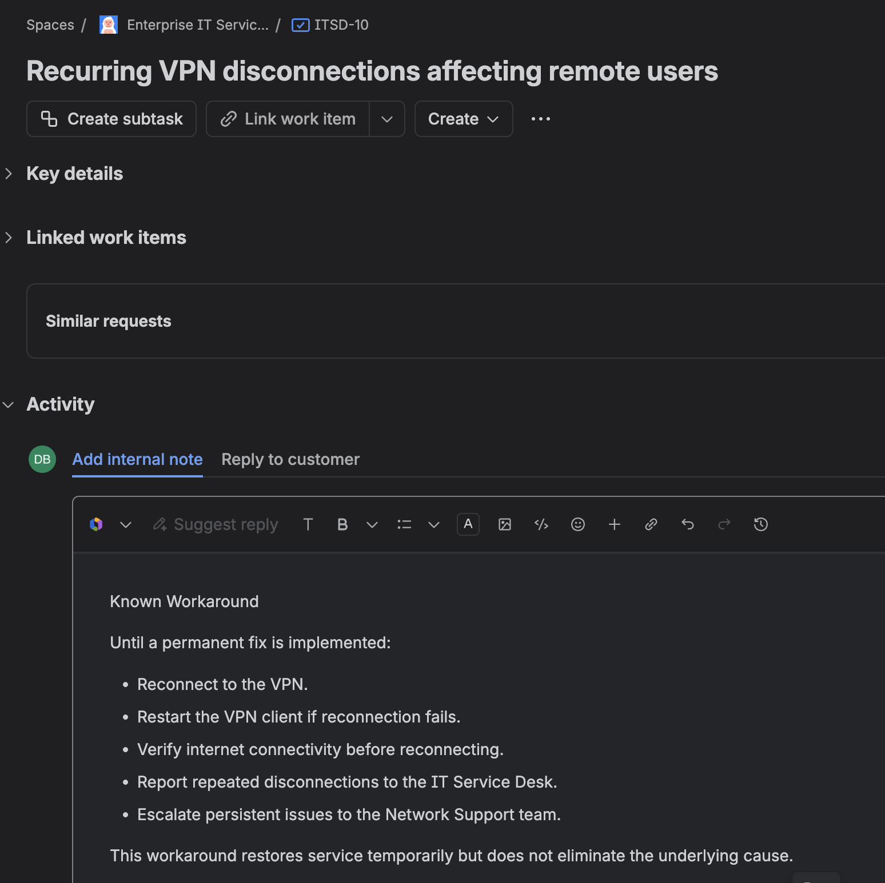
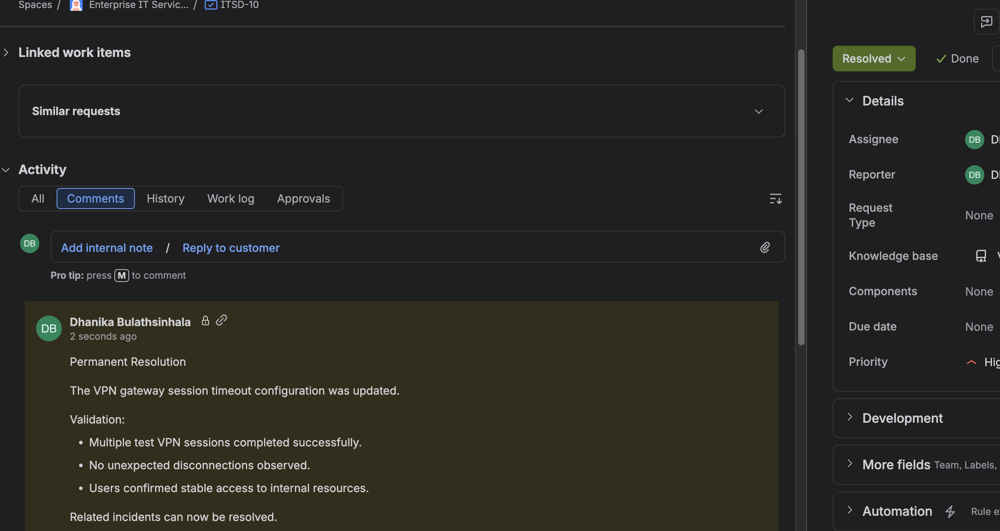

# Project 02 – Incident, Request and Problem Management

## Overview

This project demonstrates IT Service Management (ITSM) workflows using Jira Service Management.

The lab focuses on the distinction between Service Requests, Incidents and Problem Management by simulating recurring VPN connectivity issues affecting multiple users.

The project demonstrates incident correlation, root cause analysis (RCA), temporary workarounds, escalation, and permanent resolution documentation.

---

## Scenario

Several remote employees reported intermittent VPN connectivity failures while attempting to access internal corporate resources.

Initially each user contacted the IT Service Desk individually, resulting in multiple Incident records.

After identifying repeated symptoms across multiple users, the incidents were correlated to a single underlying Problem requiring root-cause investigation.

---

## Technologies

| Component | Technology |
|------------|------------|
| ITSM Platform | Jira Service Management |
| Service Desk | Enterprise IT Service Desk |
| Project Key | ITSD |
| Methodology | ITIL Incident & Problem Management |
| Scenario | Corporate VPN Service |

---

## Project Structure

```text
02-Incident-Request-and-Problem-Management/
│
├── README.md
└── Screenshots/
    ├── 01_High_Priority_VPN_Incident.png
    ├── 02_Related_VPN_Incidents.png
    ├── 03_VPN_Incident_Correlation_and_Triage.png
    ├── 04_VPN_Problem_Record.png
    ├── 05_Problem_Root_Cause_Analysis.png
    ├── 06_Known_Workaround.png
    └── 07_Problem_Resolved.png
```

---

# Incident Management

## High Priority VPN Incident

The first incident represented multiple users experiencing intermittent VPN disconnections.

Characteristics:

- High priority
- Multiple users affected
- Business impact identified
- Immediate investigation initiated

The objective of Incident Management is to restore service as quickly as possible.



---

## Related Incidents

Additional users reported the same VPN behaviour.

Rather than treating each ticket as an isolated event, related incidents were linked together to identify recurring symptoms.

Examples included:

- VPN disconnecting after authentication
- Remote users losing access to internal resources
- Internet connectivity remaining available



---

## Incident Correlation

Technical review determined:

- Multiple users affected
- Similar symptoms
- Similar timeline
- Similar business impact

This indicated that the issue was unlikely to be an isolated workstation problem.

The incident therefore required Problem Management.



---

# Problem Management

## Problem Record

A Problem record was created to investigate the underlying cause responsible for the repeated VPN incidents.

Unlike an Incident, a Problem focuses on eliminating the root cause rather than restoring service for an individual user.

The related incidents were linked to the Problem for investigation.



---

## Root Cause Analysis

The investigation concluded:

- Endpoint hardware functioning normally
- Internet connectivity available
- Authentication successful
- Multiple users affected

Probable root cause:

VPN gateway session timeout configuration.

The analysis shifted attention away from individual endpoints toward shared infrastructure.



---

## Known Workaround

A temporary workaround was documented while permanent remediation was being investigated.

Workaround:

- Reconnect VPN
- Restart VPN client
- Verify Internet connectivity
- Escalate repeated failures

The workaround restored temporary service but did not remove the underlying cause.



---

## Permanent Resolution

Following investigation, the VPN gateway configuration was corrected.

Validation included:

- Successful VPN testing
- Stable user sessions
- Confirmation from affected users

The Problem record was then resolved.



---

# Incident vs Problem

| Incident | Problem |
|-----------|----------|
| Restore service | Identify root cause |
| Individual user focus | Multiple incidents |
| Immediate recovery | Long-term prevention |
| Operational response | Root cause investigation |

---

# Workflow

```text
Incident
      │
      ▼
Additional Incidents
      │
      ▼
Incident Correlation
      │
      ▼
Problem Record
      │
      ▼
Root Cause Analysis
      │
      ▼
Known Workaround
      │
      ▼
Permanent Resolution
      │
      ▼
Problem Closed
```

---

# Skills Demonstrated

- Jira Service Management
- Incident Management
- Problem Management
- ITIL concepts
- Incident correlation
- Root Cause Analysis (RCA)
- Known Error documentation
- Workaround documentation
- Escalation
- Priority assessment
- Technical documentation
- Enterprise troubleshooting workflow

---

# Lessons Learned

- Multiple similar incidents often indicate an underlying Problem rather than isolated user issues.
- Incident Management focuses on restoring service quickly.
- Problem Management focuses on identifying and eliminating the root cause.
- Linking related incidents improves investigation efficiency.
- Root Cause Analysis helps prevent recurring service interruptions.
- Temporary workarounds allow business continuity while permanent fixes are developed.

---

# Project Outcome

This project demonstrates an ITIL-aligned workflow beginning with multiple user incidents and progressing through incident correlation, Problem investigation, root-cause analysis, workaround documentation and permanent resolution.

The project highlights the operational difference between restoring service through Incident Management and preventing recurrence through Problem Management.

---

**Status:** Completed