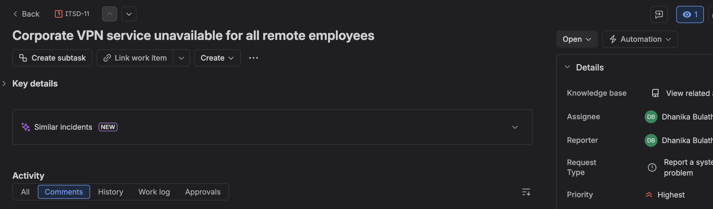
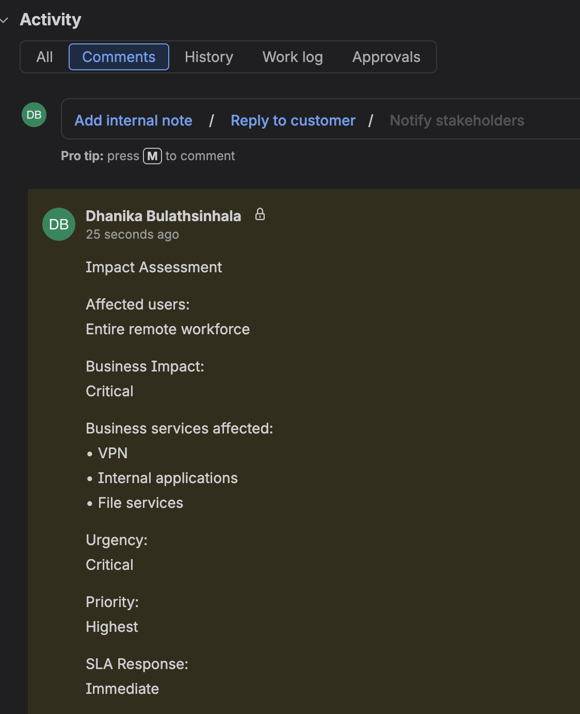
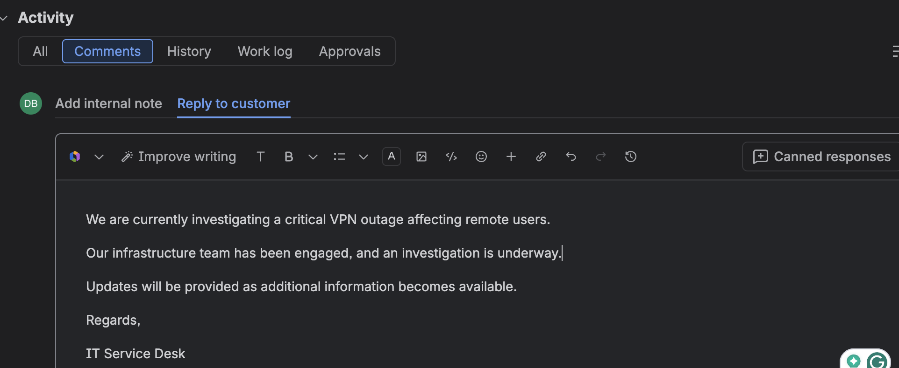
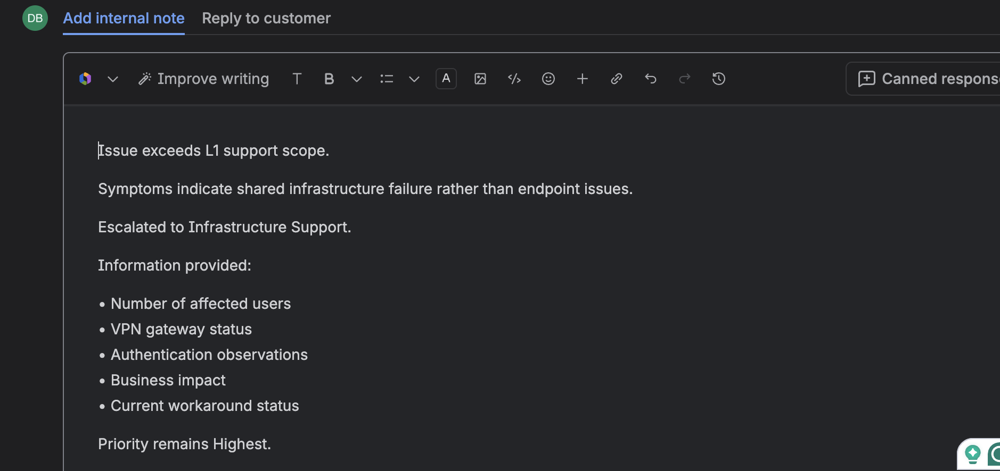
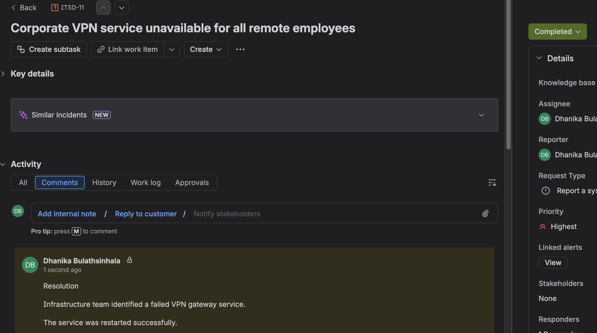

# Project 03 – SLA, Priority and Escalation Management

## Overview

This project demonstrates Service Level Agreement (SLA) awareness, business impact assessment, incident prioritisation, customer communication, and escalation procedures using Jira Service Management.

The lab simulates a critical VPN outage affecting the organization's remote workforce and follows the incident lifecycle from initial reporting through escalation, communication, and resolution.

---

## Scenario

A critical outage prevents remote employees from accessing the corporate VPN.

The issue impacts business operations across multiple departments and requires immediate investigation, customer communication, SLA prioritisation, and escalation to Infrastructure Support.

---

## Technologies

| Component | Technology |
|------------|------------|
| ITSM Platform | Jira Service Management |
| Framework | ITIL Incident Management |
| Service Desk | Enterprise IT Service Desk |
| Service | Corporate VPN |
| Scenario | Critical Service Outage |

---

## Project Structure

```text
03-SLA-Priority-and-Escalation-Management/
│
├── README.md
└── Screenshots/
    ├── 01_Critical_VPN_Incident.png
    ├── 02_Business_Impact_Assessment.png
    ├── 03_Customer_Communication.png
    ├── 04_L2_Escalation.png
    └── 05_Incident_Resolved.png
```

---

# Critical Incident

## Incident Creation

A High/Critical priority incident was created representing a complete VPN outage affecting remote employees.

Business impact included:

- Remote employees unable to work
- Internal applications unavailable
- Business operations disrupted

The incident was classified as requiring immediate investigation.



---

# Business Impact Assessment

The incident was assessed using business impact and urgency.

Assessment included:

- Number of users affected
- Business services impacted
- Operational impact
- Priority assignment
- Initial SLA response requirements

Business Impact:

```text
Critical
```

Priority:

```text
Highest
```

Initial response:

```text
Immediate
```



---

# Customer Communication

Customer communication was issued to acknowledge the outage and inform users that investigation had begun.

The communication included:

- Confirmation that IT was aware of the issue
- Notification that Infrastructure Support was investigating
- Commitment to provide updates



---

# Escalation Management

The issue exceeded normal L1 troubleshooting responsibilities and required escalation.

Escalation documentation included:

- Business impact
- Number of affected users
- VPN gateway observations
- Authentication findings
- Current investigation status

The incident remained at the highest priority while Infrastructure Support investigated the underlying infrastructure.



---

# Resolution

Infrastructure Support identified the VPN gateway service as the source of the outage.

Following restoration:

- VPN connectivity returned
- User authentication succeeded
- Remote employees regained access
- Business services resumed normal operation

The incident was resolved and documented.



---

# Priority Assessment

| Priority | Typical Business Impact |
|-----------|------------------------|
| Low | Minor inconvenience |
| Medium | Single user or limited service disruption |
| High | Multiple users or important business service affected |
| Highest | Critical business service unavailable |

---

# SLA Awareness

This project demonstrates how business impact influences incident response.

Higher priority incidents require:

- Faster acknowledgement
- Immediate investigation
- Frequent customer updates
- Rapid escalation
- Timely resolution

---

# Escalation Workflow

```text
Critical Incident
        │
        ▼
Business Impact Assessment
        │
        ▼
Priority Assignment
        │
        ▼
Customer Communication
        │
        ▼
L1 Investigation
        │
        ▼
Infrastructure Escalation
        │
        ▼
Service Restoration
        │
        ▼
Resolution
```

---

# Skills Demonstrated

- Jira Service Management
- ITIL Incident Management
- SLA awareness
- Business impact assessment
- Incident prioritisation
- Customer communication
- Escalation management
- Infrastructure escalation
- Resolution documentation
- Enterprise service desk operations

---

# Lessons Learned

- Incident priority should reflect business impact rather than technical complexity.
- Customer communication is an essential part of incident management.
- Critical incidents require rapid escalation when they exceed L1 capabilities.
- Accurate documentation improves coordination between support teams.
- SLA objectives help determine response urgency and resource allocation.

---

# Project Outcome

This project demonstrates an enterprise incident-management workflow from initial reporting through business impact assessment, customer communication, escalation, and final resolution.

The lab highlights practical IT Support responsibilities beyond technical troubleshooting by emphasizing service restoration, communication, and SLA-driven decision making.

---

**Status:** Completed