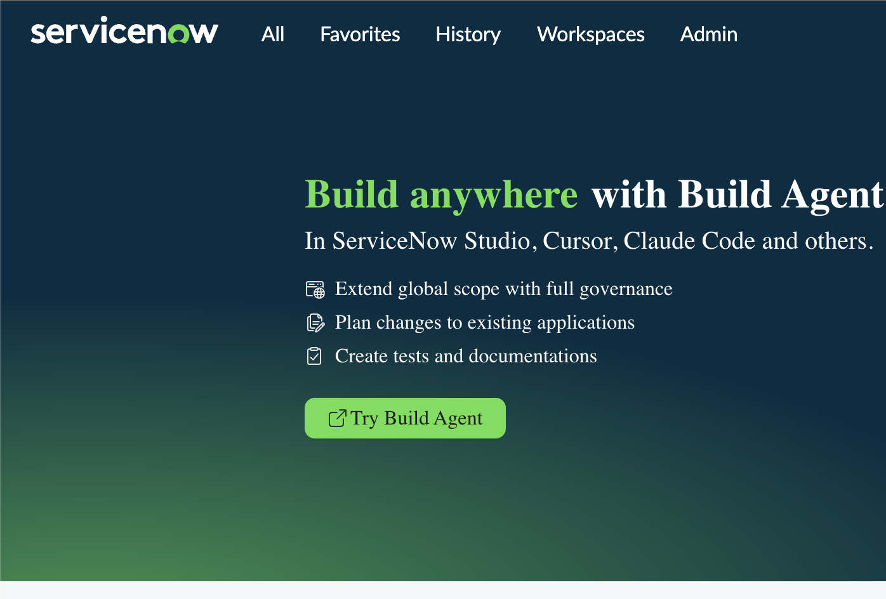
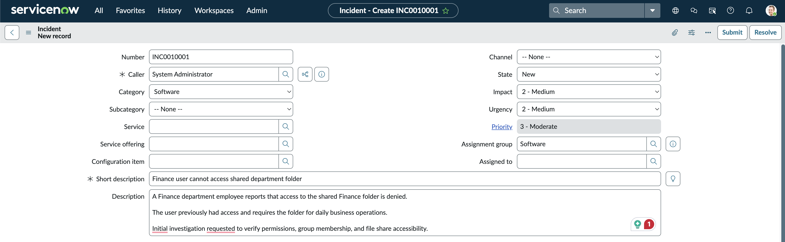
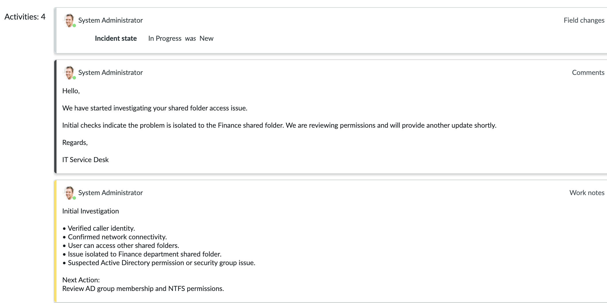
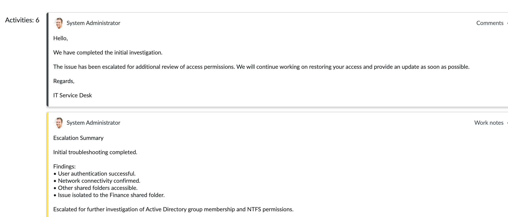
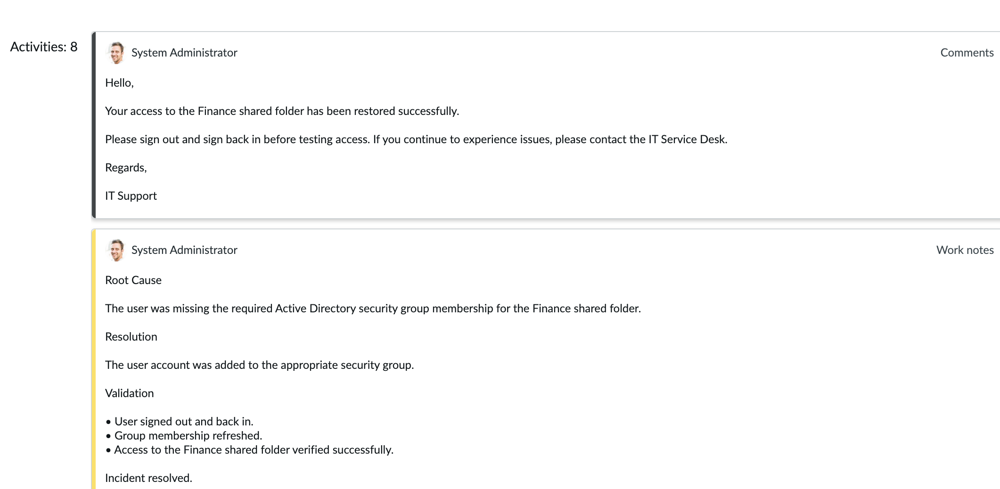

# Project 04 – ServiceNow ITSM Fundamentals

## Overview

This project demonstrates the fundamental incident-management workflow in ServiceNow.

The lab covers incident creation, categorisation, prioritisation, assignment-group handling, internal investigation notes, customer communication, escalation, technical resolution, and closure.

---

## Scenario

A Finance department user reports that access to the shared Finance folder has been denied.

The user previously had access and requires the folder for daily work. The Service Desk must investigate the issue, document findings, communicate with the user, escalate the access review, and record the final resolution.

---

## Technologies

| Component | Technology |
|---|---|
| ITSM Platform | ServiceNow |
| Environment | Personal Developer Instance |
| Module | Incident Management |
| Scenario | Shared-folder access issue |
| Support Role | L1 IT Support |

---

## Project Structure

```text
04-ServiceNow-ITSM-Fundamentals/
├── README.md
└── Screenshots/
    ├── 01_ServiceNow_Navigator.png
    ├── 02_New_Incident_Form.png
    ├── 03_Incident_Investigation.png
    ├── 04_Incident_Escalation.png
    └── 05_Incident_Resolved.png
```

---

# ServiceNow Navigation

The ServiceNow Application Navigator was used to locate the Incident Management module and access incident lists and forms.

This provided initial familiarity with the ServiceNow interface and core ITSM navigation.



---

# Incident Creation

A new incident was created with the following details:

```text
Short description:
Finance user cannot access shared department folder

Caller:
System Administrator

Category:
Software

Impact:
2 - Medium

Urgency:
2 - Medium

Priority:
3 - Moderate

Assignment group:
Help Desk
```

The incident description documented the user's loss of access and the need to investigate permissions, group membership, and file-share accessibility.



---

# Initial Investigation

The incident was moved into active investigation.

Initial checks included:

- Caller identity verification
- Network-connectivity confirmation
- Testing access to other shared folders
- Isolating the issue to the Finance shared folder
- Reviewing possible Active Directory group-membership or NTFS-permission issues

The technical findings were recorded in internal work notes.

A customer-facing update was also added to explain that the issue was under investigation.



---

# Work Notes and Customer Comments

ServiceNow separates internal technical documentation from customer communication.

| Field | Visibility | Purpose |
|---|---|---|
| Work notes | Internal IT staff | Investigation, findings, escalation, and technical actions |
| Additional comments | Customer visible | Progress updates and user communication |

This distinction allows support technicians to document detailed technical work while providing clear, appropriate updates to the user.

---

# Incident Escalation

After completing the initial L1 investigation, the incident was escalated for further review.

The escalation documentation included:

- Successful user authentication
- Confirmed network connectivity
- Access to other shared folders
- Isolation of the issue to the Finance folder
- Suspected Active Directory group-membership or NTFS-permission issue

The customer was informed that the permissions issue required further investigation.



---

# Technical Resolution

The recorded root cause was that the user was missing the required Active Directory security-group membership for the Finance shared folder.

The resolution process included:

1. Adding the user to the authorised security group.
2. Having the user sign out and sign back in.
3. Refreshing the user's access token and group membership.
4. Verifying access to the Finance shared folder.
5. Confirming that the required files were accessible.

The incident was then moved to the resolved state.



---

# Incident Lifecycle

```text
User Reports Issue
        │
        ▼
Incident Created
        │
        ▼
Categorisation and Priority
        │
        ▼
Assignment Group
        │
        ▼
Initial Investigation
        │
        ▼
Work Notes and Customer Update
        │
        ▼
Escalation
        │
        ▼
Technical Resolution
        │
        ▼
Incident Resolved
```

---

## Skills Demonstrated

- ServiceNow navigation
- Incident creation
- Incident categorisation
- Impact and urgency assessment
- Priority calculation
- Assignment-group handling
- Work-note documentation
- Customer-facing communication
- Incident investigation
- L1 escalation
- Active Directory access troubleshooting
- Shared-folder permission troubleshooting
- Resolution documentation
- Incident lifecycle management
- ITSM fundamentals

---

## Lessons Learned

- ServiceNow uses structured incident forms to maintain consistent support records.
- Impact and urgency influence incident priority.
- Assignment groups determine which support team owns the incident.
- Work notes should contain detailed internal troubleshooting information.
- Additional comments should provide clear customer-facing updates.
- Escalation notes should document completed L1 checks to prevent duplicated troubleshooting.
- Resolution notes should record the root cause, corrective action, and validation performed.
- Access problems may be caused by missing group membership even when user authentication and network connectivity are functioning normally.

---

## Project Outcome

This project demonstrates a complete ServiceNow incident-management workflow from ticket creation through investigation, communication, escalation, resolution, and closure.

It provides practical evidence of ServiceNow familiarity and IT Support processes commonly used in enterprise service-desk environments.

---

**Status:** Completed