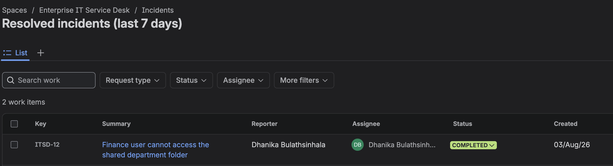
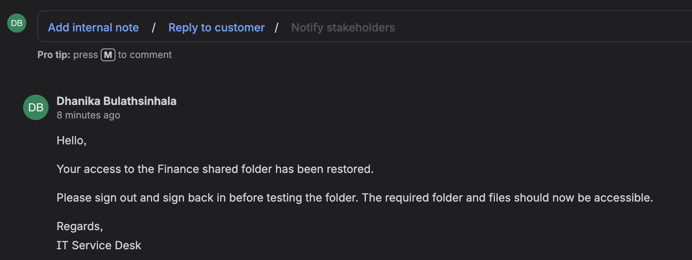
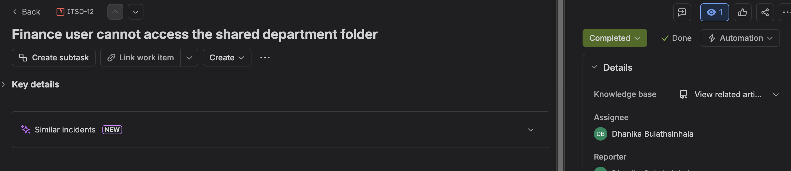

# Project 04 – ServiceNow ITSM Fundamentals

## Overview

This project introduces the core functionality of ServiceNow IT Service Management (ITSM) by simulating the lifecycle of an enterprise support incident.

The lab demonstrates how ServiceNow is used by IT Support teams to create, investigate, document, escalate, and resolve incidents while maintaining communication with end users.

---

## Scenario

A Finance department employee reports that access to a shared department folder has been lost.

The objective is to investigate the issue, document troubleshooting activities, communicate with the user, escalate when appropriate, restore access, and close the incident.

---

## Technologies

| Component | Technology |
|------------|------------|
| ITSM Platform | ServiceNow |
| Module | Incident Management |
| Environment | ServiceNow Developer Instance |
| Scenario | Shared Folder Access |
| Support Role | L1 IT Support |

---

## Project Structure

```text
04-ServiceNow-ITSM-Fundamentals/
│
├── README.md
└── Screenshots/
    ├── 01_New_Incident.png
    ├── 02_Incident_Triage.png
    ├── 03_Customer_Update.png
    ├── 04_Incident_Escalation.png
    └── 05_Incident_Resolution.png
```

---

# Incident Creation

A new ServiceNow incident was created for a Finance user who was unable to access a shared department folder.

The incident captured:

- User information
- Business impact
- Assignment
- Priority
- Initial investigation details


---

# Initial Investigation

The incident was reviewed by the Service Desk.

Initial troubleshooting included:

- Verifying user authentication
- Confirming network connectivity
- Testing access to other shared resources
- Identifying that the issue affected only the Finance shared folder

The findings were documented using internal investigation notes.



---

# Customer Communication

The user received an update confirming that the issue was under investigation.

The communication explained:

- Initial checks completed
- Current investigation status
- Next troubleshooting steps

Maintaining communication throughout the incident lifecycle helps manage user expectations.



---

# Escalation

After completing L1 troubleshooting, the issue was escalated for further investigation.

The escalation included:

- Summary of completed troubleshooting
- Current findings
- Suspected permission-related issue
- Request for advanced investigation

This ensured the next support team could continue the investigation without repeating previous work.


---

# Resolution

Investigation determined that the user was missing the required Active Directory security group membership for the Finance shared folder.

The required permissions were restored and the user confirmed successful access.

Resolution documentation included:

- Root cause
- Corrective action
- Validation performed
- User confirmation

The incident was then resolved.



---

# Incident Lifecycle

```text
User Reports Issue
        │
        ▼
Incident Created
        │
        ▼
Initial Investigation
        │
        ▼
Customer Communication
        │
        ▼
Technical Investigation
        │
        ▼
Escalation (if required)
        │
        ▼
Resolution
        │
        ▼
Incident Closure
```

---

# Skills Demonstrated

- ServiceNow Navigation
- Incident Management
- IT Service Management (ITSM)
- Incident Prioritisation
- Ticket Assignment
- Customer Communication
- Technical Documentation
- Incident Escalation
- Root Cause Identification
- Resolution Documentation
- Enterprise IT Support Workflow

---

# Lessons Learned

- ServiceNow provides a structured workflow for managing incidents from creation to closure.
- Clear internal documentation improves collaboration between support teams.
- Customer updates should be timely and easy to understand.
- Escalation should include all troubleshooting already completed.
- Accurate resolution notes create a valuable support history for future incidents.

---

# Project Outcome

This project demonstrates the fundamental ServiceNow incident management workflow used by enterprise IT support teams.

The lab covers the complete lifecycle of an incident, including ticket creation, investigation, communication, escalation, resolution, and closure, providing practical experience with one of the industry's leading ITSM platforms.

---

**Status:** Completed