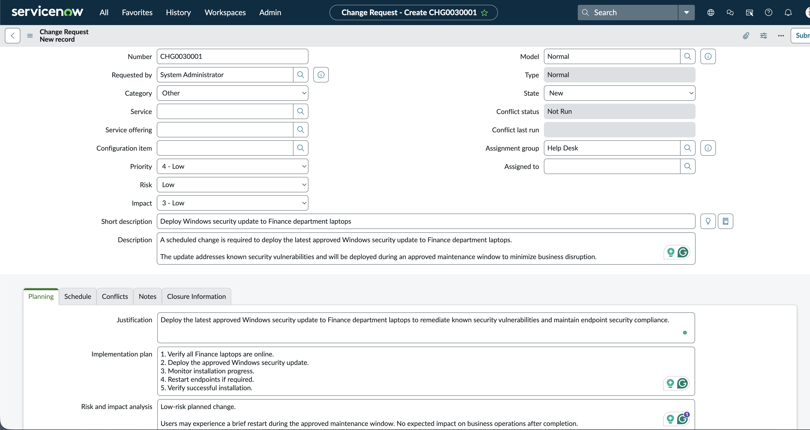
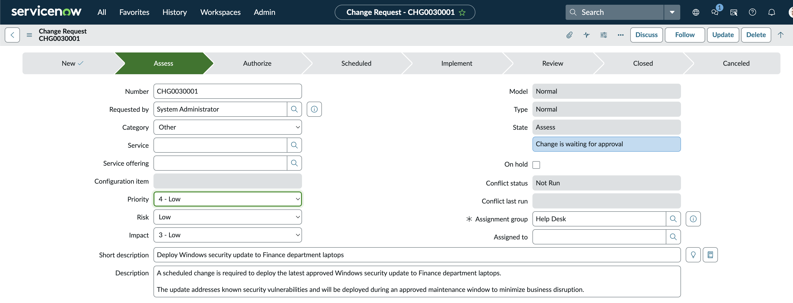
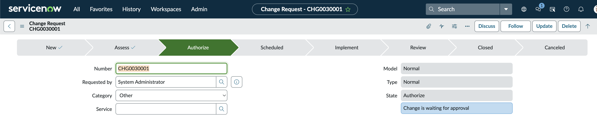
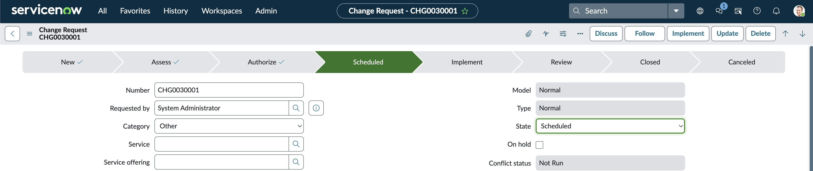
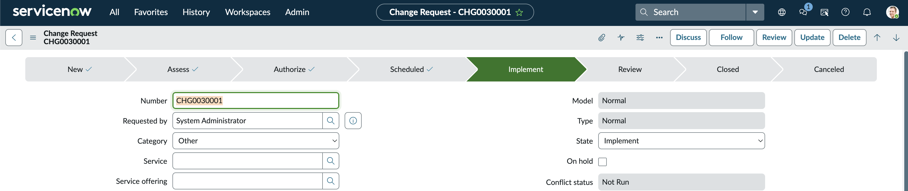
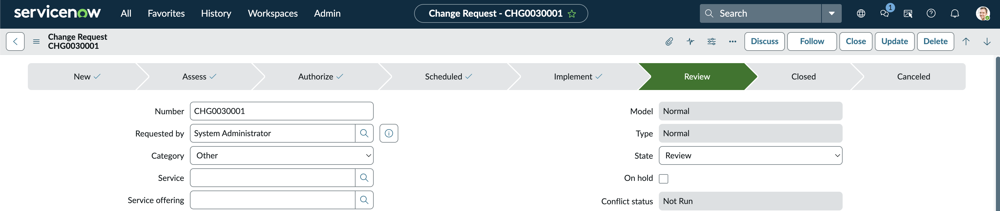
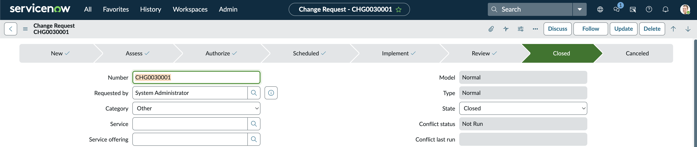

# Project 05 – ServiceNow Change Management

## Overview

This project demonstrates the ITIL Change Management process using ServiceNow.

A Normal Change Request was created to deploy a Windows security update to Finance department laptops. The project follows the complete change lifecycle, including planning, assessment, approval, scheduling, implementation, post-implementation review, and closure.

---

## Scenario

The Finance department requires deployment of the latest approved Windows security update to all departmental laptops.

The update addresses known security vulnerabilities and is scheduled during an approved maintenance window to minimise business disruption.

---

## Technologies

| Component | Technology |
|------------|------------|
| Platform | ServiceNow |
| Module | Change Management |
| Environment | Personal Developer Instance |
| Framework | ITIL 4 Change Enablement |

---

## Project Structure

```text
05-ServiceNow-Change-Management/
├── README.md
└── Screenshots/
    ├── 01_Normal_Change_Request.png
    ├── 02_Change_Assessment.png
    ├── 03_Change_Authorized.png
    ├── 04_Change_Scheduled.png
    ├── 05_Change_Implementation.png
    ├── 06_Post_Implementation_Review.png
    └── 07_Change_Closed.png
```

---

# Change Request Creation

A Normal Change Request was created for the planned deployment of Windows security updates.

**Change Details**

- Model: Normal
- Type: Normal
- Risk: Low
- Impact: Low
- Assignment Group: Help Desk

The change included a business justification and deployment description aligned with enterprise maintenance practices.



---

# Change Assessment

The change entered the assessment phase where technical feasibility and implementation risks were evaluated.

Assessment activities included:

- Security update verification
- Compatibility review
- Risk assessment
- Business impact evaluation
- Maintenance window confirmation

The change was determined to present a low implementation risk.



---

# Change Authorization

The change request was submitted through the approval workflow and progressed to the authorization stage.

The authorization confirmed:

- Technical assessment completed
- Business justification accepted
- Deployment approved
- Implementation authorised



---

# Change Scheduling

The deployment was scheduled during an approved maintenance window.

Planning activities included:

- Planned start and end times
- Stakeholder notification
- Downtime estimation
- Resource availability

Scheduling work outside business hours reduced operational impact.



---

# Change Implementation

The approved Windows security update was deployed during the scheduled maintenance window.

Implementation activities included:

- Verifying device availability
- Deploying Windows updates
- Restarting affected systems
- Monitoring installation progress
- Validating successful installation

No implementation issues were identified.



---

# Post-Implementation Review

Following deployment, the implementation was reviewed to verify that all objectives had been achieved.

Review activities included:

- Confirming successful installation
- Validating Microsoft 365 functionality
- Confirming user access
- Checking for unexpected incidents

The implementation completed without requiring rollback.



---

# Change Closure

After successful validation, the change request was formally closed.

Closure documentation recorded:

- Successful deployment
- Validation results
- No user-reported issues
- No rollback required

The change lifecycle was completed successfully.



---

# Change Lifecycle

```text
New
   │
   ▼
Assess
   │
   ▼
Authorize
   │
   ▼
Scheduled
   │
   ▼
Implement
   │
   ▼
Review
   │
   ▼
Closed
```

---

## Skills Demonstrated

- ServiceNow Change Management
- ITIL Change Enablement
- Normal Change Requests
- Risk Assessment
- Business Impact Analysis
- Implementation Planning
- Maintenance Window Scheduling
- Change Approval Workflow
- Deployment Validation
- Post-Implementation Review
- Change Closure
- Enterprise IT Change Control

---

## Lessons Learned

- Normal Changes require structured planning before implementation.
- Risk and impact assessments guide change approval decisions.
- Maintenance windows minimise business disruption.
- Formal approval workflows reduce operational risk.
- Post-implementation reviews verify successful deployment.
- Proper documentation provides traceability throughout the change lifecycle.

---

## Project Outcome

This project demonstrates a complete enterprise change management process using ServiceNow, following ITIL best practices from change creation through successful implementation and closure.

---

**Status:** Completed