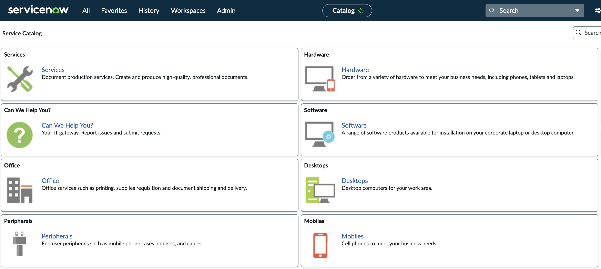
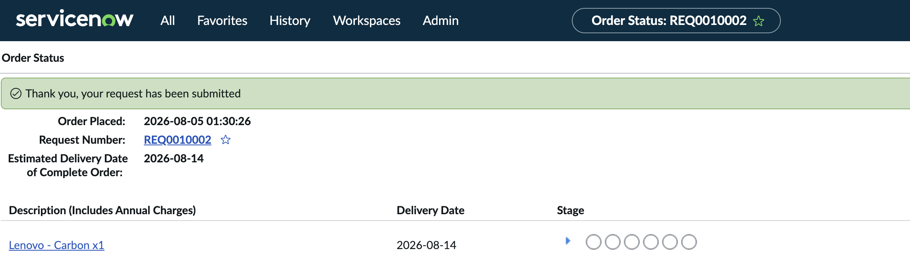
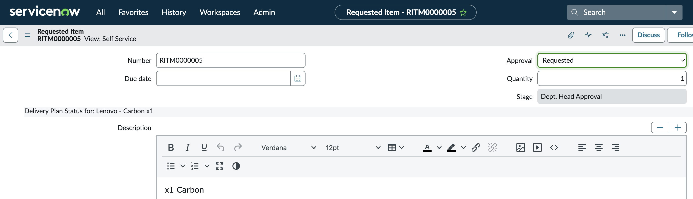
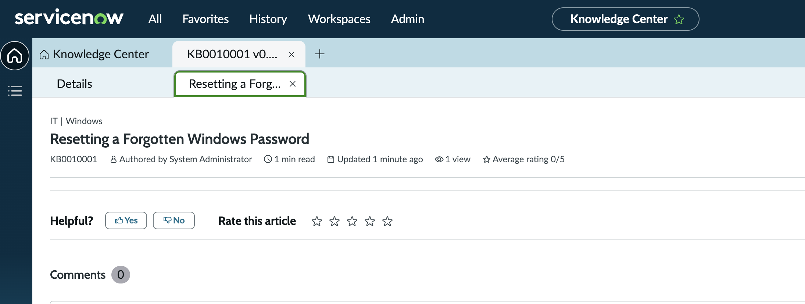
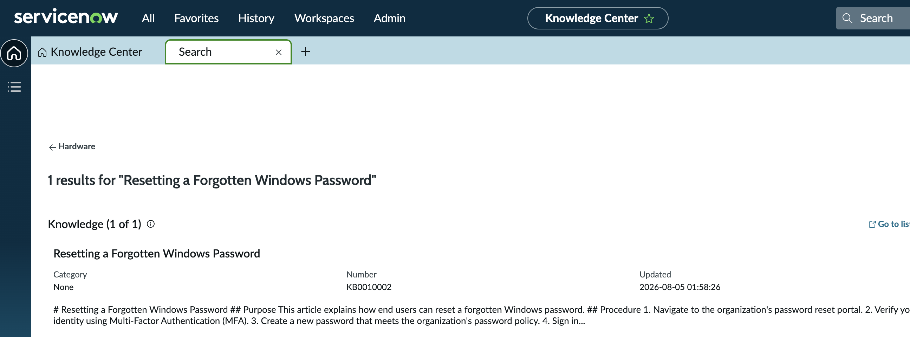

# Project 07 – ServiceNow Service Operations

## Overview

This project demonstrates ServiceNow service operations beyond incident management.

The lab covers the Service Catalog, service-request submission, requested-item tracking, approval stages, request fulfilment, Knowledge Management, and self-service knowledge search.

---

## Scenario

An employee requires a standard corporate laptop because the existing device has reached the end of its lifecycle.

The request is submitted through the ServiceNow Service Catalog, recorded as a Requested Item, and routed through an approval stage.

A Knowledge article is also created to support users who need to reset a forgotten Windows password.

---

## Objectives

- Explore the ServiceNow Service Catalog
- Submit a standard hardware request
- Review Request and Requested Item records
- Understand REQ and RITM records
- Review approval and fulfilment stages
- Create a Knowledge article
- Search for published or draft Knowledge content
- Understand self-service support workflows

---

## Technologies

| Component | Technology |
|---|---|
| Platform | ServiceNow |
| Environment | Personal Developer Instance |
| Module | Service Catalog |
| Module | Request Management |
| Module | Knowledge Management |
| Catalog Item | Standard Laptop |
| Knowledge Scenario | Windows password reset |

---

## Project Structure

```text
07-ServiceNow-Service-Operations/
├── README.md
└── Screenshots/
    ├── 01_Service_Catalog.png
    ├── 02_Service_Request_Submitted.png
    ├── 03_Request_Fulfilment.png
    ├── 04_Knowledge_Article.png
    └── 05_Knowledge_Search.png
```

---

# Service Catalog

The ServiceNow Service Catalog provides users with a structured self-service interface for requesting standard IT products and services.

Available catalog categories included:

- Hardware
- Software
- Desktops
- Mobile devices
- Peripherals
- Office services
- General support services



---

# Standard Laptop Request

A standard laptop was requested through the Service Catalog.

The request represented a common enterprise fulfilment scenario where a user requires replacement hardware because an existing device has reached the end of its lifecycle.

The catalog request captured information such as:

- Requested item
- Requested user
- Quantity
- Business justification
- Hardware model
- Approval status



---

# Request and Requested Item Records

ServiceNow separates a submitted request into related records.

```text
REQ
 │
 └── RITM
      │
      └── SCTASK, where generated
```

## Request

The Request record represents the overall order submitted by the user.

## Requested Item

The Requested Item record represents an individual catalog item contained within the request.

The laptop request created a Requested Item record showing:

- RITM number
- Requested product
- Quantity
- Approval status
- Current fulfilment stage

The request entered the department-head approval stage and awaited further fulfilment processing.



---

# Request Fulfilment Workflow

The service-request workflow demonstrated in this project was:

```text
User Opens Service Catalog
          │
          ▼
Selects Standard Laptop
          │
          ▼
Submits Request
          │
          ▼
Request Record Created
          │
          ▼
Requested Item Created
          │
          ▼
Approval Stage
          │
          ▼
Fulfilment
```

The exact tasks generated by a ServiceNow catalog item depend on its configured workflow. In this developer instance, the requested item entered the department-head approval stage.

---

# Knowledge Management

A Knowledge article was created to document a common IT Support procedure.

## Article

```text
Resetting a Forgotten Windows Password
```

The article included:

- Purpose
- Password-reset procedure
- MFA identity verification
- Password-policy guidance
- Troubleshooting steps
- Escalation instructions



---

# Knowledge Search

The article was searched for through the ServiceNow Knowledge interface.

This demonstrated how users and support technicians can locate reusable troubleshooting information before creating or escalating an incident.



---

# Self-Service Support

Service Catalog and Knowledge Management support two different self-service needs.

| Service Catalog | Knowledge Management |
|---|---|
| Used to request products or services | Used to locate support information |
| Creates request records | Creates reusable documentation |
| Supports approvals and fulfilment | Supports issue prevention and self-resolution |
| Examples: laptop, software, access | Examples: password reset, VPN, Outlook |

Together, these features reduce manual service-desk workload and provide users with structured support channels.

---

## Skills Demonstrated

- ServiceNow Service Catalog
- Service-request submission
- Request Management
- Request records
- Requested Item records
- REQ and RITM relationships
- Approval-stage tracking
- Request fulfilment concepts
- Hardware-request workflows
- Knowledge Management
- Knowledge article creation
- Knowledge search
- Self-service support
- ITSM service operations
- User-facing service delivery

---

## Lessons Learned

- Service Catalog provides a controlled method for requesting standard IT services.
- A Request can contain one or more Requested Items.
- Requested Items can move through approval and fulfilment stages.
- Catalog Tasks depend on the workflow configured for the selected catalog item.
- Knowledge articles provide reusable solutions for common support issues.
- Effective Knowledge content should include purpose, procedure, troubleshooting, and escalation.
- Service Catalog and Knowledge Management complement Incident Management by reducing unnecessary tickets.
- Self-service improves consistency and gives users clearer access to IT support.

---

## Project Outcome

This project demonstrated a ServiceNow service-operations workflow covering a hardware request and a Knowledge Management use case.

The lab provided practical experience with Service Catalog navigation, request submission, Requested Item tracking, approval stages, Knowledge article creation, and self-service search.

---

**Status:** Completed