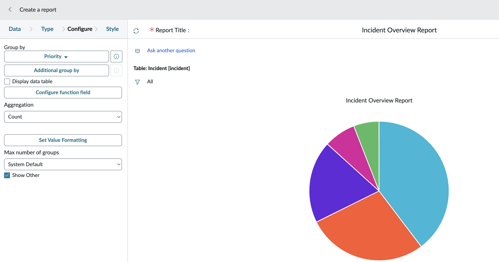
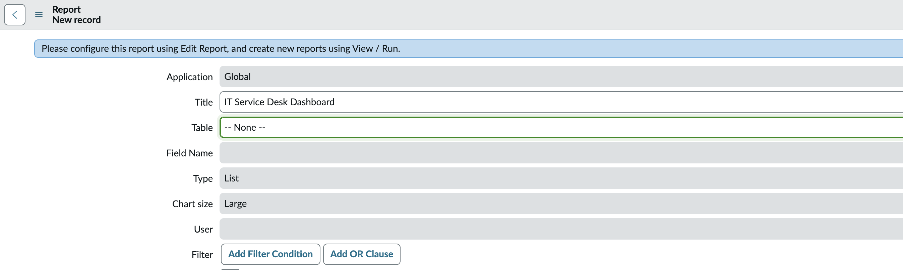
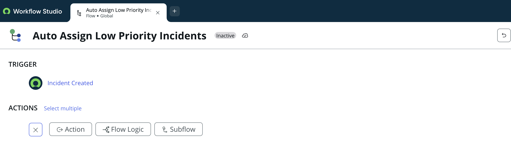
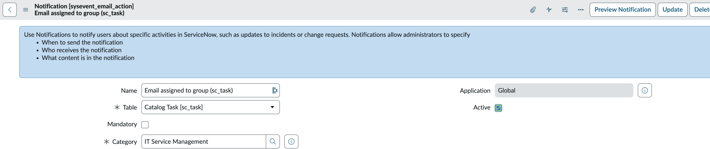

# Project 08 – ServiceNow Reporting and Automation

## Overview

This project demonstrates reporting, dashboards, workflow automation, and notification capabilities within ServiceNow.

The lab focuses on creating incident reports, visualizing IT service data, exploring dashboards, reviewing Flow Designer automation, and examining email notifications used during IT service-management processes.

---

## Scenario

An IT Service Desk manager requires better visibility into operational performance through reports and dashboards while also improving efficiency using workflow automation and system notifications.

This project demonstrates how ServiceNow supports reporting, automation, and communication across ITSM processes.

---

## Objectives

- Create an Incident report
- Visualize incident data using charts
- Explore ServiceNow dashboards
- Review Flow Designer
- Understand workflow automation
- Review system email notifications
- Understand reporting and operational visibility

---

## Technologies

| Component | Technology |
|---|---|
| Platform | ServiceNow |
| Environment | Personal Developer Instance |
| Module | Reports |
| Module | Dashboards |
| Module | Flow Designer |
| Module | Notifications |

---

## Project Structure

```text
08-ServiceNow-Reporting-and-Automation/
├── README.md
└── Screenshots/
    ├── 01_Incident_Pie_Chart.png
    ├── 02_IT_Dashboard.png
    ├── 03_Flow_Designer.png
    └── 04_Email_Notification.png
```

---

# Incident Reporting

An Incident report was created to visualize service-desk information.

The report used ServiceNow reporting capabilities to summarize Incident records using graphical visualization.

The report demonstrates how support teams can quickly understand operational data without manually reviewing individual records.



---

# IT Service Dashboard

ServiceNow dashboards provide a centralized operational view of IT service activities.

Dashboards combine multiple reports and widgets into a single interface, allowing support teams and managers to monitor service performance.

Typical dashboard components include:

- Incident statistics
- Request trends
- Change metrics
- Asset information
- Service performance indicators



---

# Flow Designer

Flow Designer provides low-code workflow automation for ServiceNow.

Typical automation scenarios include:

- Automatic incident assignment
- Approval workflows
- Request notifications
- Escalation processes
- Change approvals

Workflow automation reduces repetitive manual work while improving consistency across IT service processes.



---

# Email Notifications

ServiceNow automatically generates notifications based on configured events and workflows.

Notifications commonly support:

- Incident updates
- Request approvals
- Change approvals
- Assignment notifications
- Service-request updates

These automated communications keep users and support teams informed throughout the service lifecycle.



---

# Reporting and Automation Workflow

```text
Incident Created
        │
        ▼
Incident Report Updated
        │
        ▼
Dashboard Refreshed
        │
        ▼
Workflow Triggered
        │
        ▼
Notification Sent
```

---

## Skills Demonstrated

- ServiceNow Reporting
- Incident Reporting
- Data Visualization
- Pie Charts
- Dashboards
- Flow Designer
- Workflow Automation
- Email Notifications
- IT Operations Monitoring
- Operational Reporting
- Low-Code Automation
- ServiceNow Administration

---

## Lessons Learned

- Reports provide operational insight into IT service activities.
- Dashboards consolidate multiple reports into a single monitoring interface.
- Visual reports help identify service trends more efficiently than raw data.
- Flow Designer enables low-code workflow automation.
- Automated notifications improve communication between users and IT support teams.
- Reporting and automation work together to improve operational efficiency and service visibility.

---

## Project Outcome

This project demonstrated how ServiceNow supports operational reporting, dashboard visualization, workflow automation, and automated notifications.

The lab provided practical experience using ServiceNow reporting tools and understanding how automation improves IT service delivery and operational monitoring.

---

**Status:** Completed